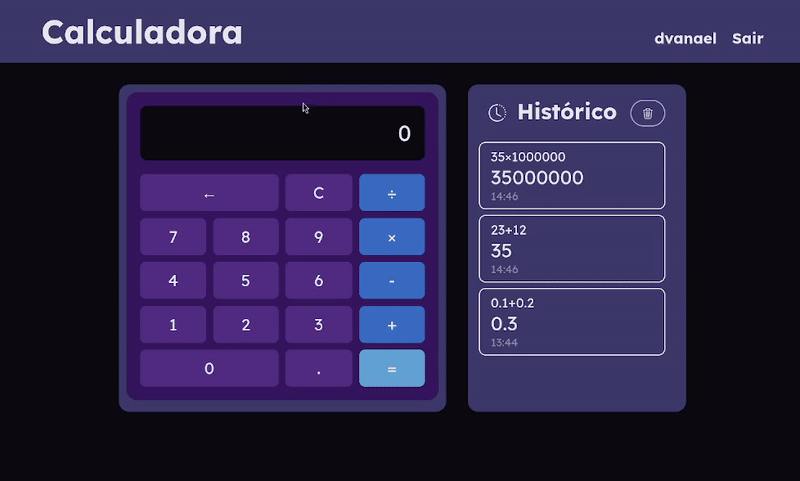

<section align="center">
<h1 >Calculadora com Histórico</h1>

  <a href="#sobre">Sobre</a> •
  <a href="#tecnologias">Tecnologias</a> •
  <a href="#apresentação">Apresentação</a> •
  <a href="#endpoints">Endpoints</a> •
  <a href="#instalação">Instalação</a>

</section>

## Sobre

Esse projeto é um aplicação web simples de uma **calculadora que executa as quatro operações básicas** e faz registro no histórico.

O projeto conta com uma **API**, usando o Django Rest Framework, que **retorna os dados de usuários e operações.** Também, com cliente básico para login e renderização da interface.

Algumas das funcionalidades da aplicação são:

- Login, logout e registro de usuários no sistema.
- Calculadora básica e histórico de operações.

---

## Tecnologias

Essas são as tecnologias usadas nesse projeto.

![django][DJANGO__BADGE]
![python][PYTHON__BADGE]
![mysql][MYSQL__BADGE]
![docker][DOCKER__BADGE]
![html][HTML__BADGE]
![css][CSS__BADGE]
![javascript][JAVASCRIPT__BADGE]

---

## Apresentação

Fotos e vídeos do sistema funcionando.

---

## Endpoints

Para acessar todos os endpoints da API, é necessário login em `/accounts/login/`.

* `GET /api/users/` — Lista usuários

* `GET /api/users/{id}/` — Detalha um usuário

* `GET /api/me/` — Usuário autenticado

* `GET|POST|PUT|DELETE /api/operations/` — Operações gerais

* `GET|POST|PUT|DELETE /api/operations/{id}/` — Operação específica

* `GET|POST|PUT|DELETE /api/users/{user_id}/operations/` — Operações de um usuário

* `GET|POST|PUT|DELETE /api/users/{user_id}/operations/{op_id}/` — Operação específica de um usuário

---

## Instalação

Acesse [docs/install.md](docs/install.md) e confira como rodar localmente o sistema!

---

[DJANGO__BADGE]: https://img.shields.io/badge/-Django-0d1117?style=for-the-badge&logo=Django&logoColor=green
[PYTHON__BADGE]: https://img.shields.io/badge/-Python-0d1117?style=for-the-badge&logo=Python
[HTML__BADGE]: https://img.shields.io/badge/-HTML5-0d1117?style=for-the-badge&logo=html5&logoColor
[CSS__BADGE]: https://img.shields.io/badge/-CSS3-0d1117?style=for-the-badge&logo=css&logoColor=blue
[JAVASCRIPT__BADGE]: https://img.shields.io/badge/-JavaScript-0d1117?style=for-the-badge&logo=javascript&logoColor
[MYSQL__BADGE]: https://img.shields.io/badge/-MySQL-0d1117?style=for-the-badge&logo=mysql&logoColor
[DOCKER__BADGE]: https://img.shields.io/badge/-Docker-0d1117?style=for-the-badge&logo=docker&logoColor
